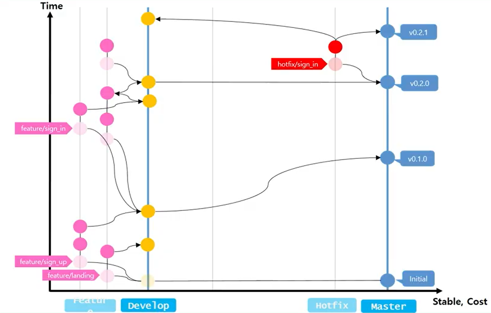
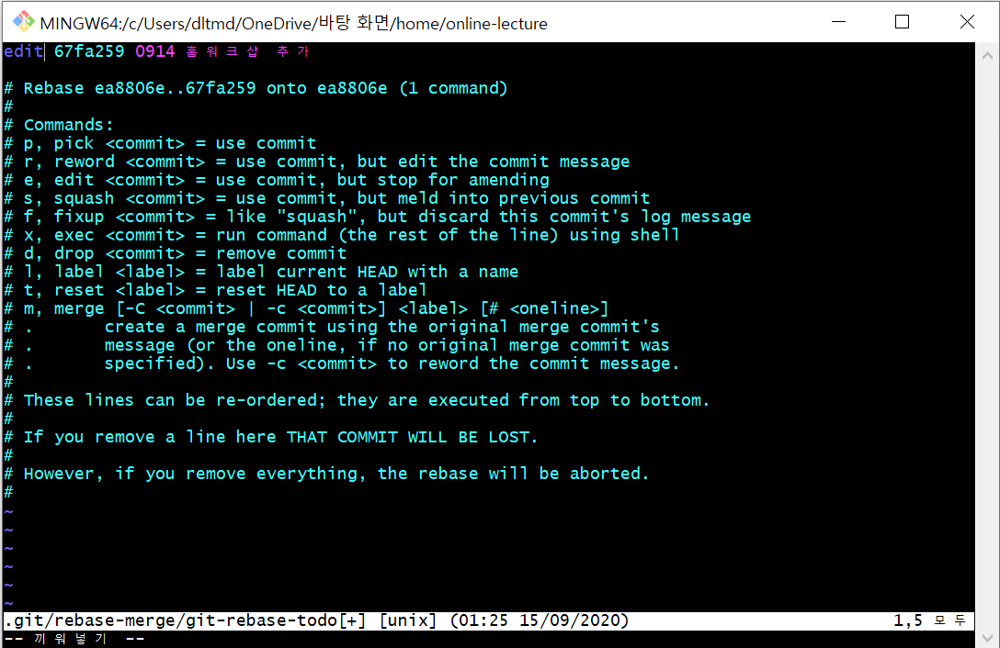
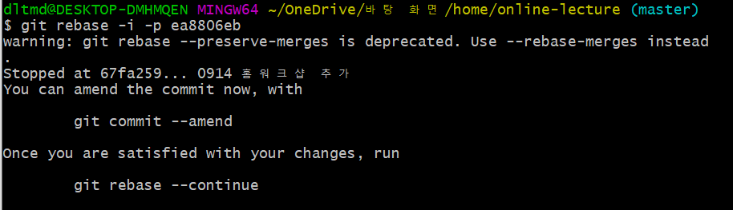

[TOC]

# Git

>Git은 분산 버전 관리 시스템(DVCS)이다.

>Git을 사용하는 목적은 다양하다. 
>
>싱글 플레이 : 코드 관리 / 백업
>
>멀티 플레이 : 협업 Workflow / 서비스 이력관리 / 커밋 규칙과 정확한 메시지 / 코드 리뷰

Repository

Command : [Git Cheat Sheet](https://education.github.com/git-cheat-sheet-education.pdf)

Git Flow ( 깃 브랜치 전략 중 하나)




- 명령어

commit, branch, checkout, cherry-pick, reset, revert, rebase, merge

`commit` : Git 저장소에 나의 디렉토리에 잇는 모든 파일에 대한 스냅샷을 기록하는 것이다. 커밋할 때마다 디렉토리 전체를 복사하진 않고, 저장소의 이전버전과 다음버전의 변경 내역 ("delta")를 저장한다. 그래서 대부분의 커밋은 그 커밋 위의 부모 커밋을 가리킨다. 

```
git commit
```

`branch` : 특정 커밋에 대한 참조이다. 브랜치는 매우 가벼워서 많이 만들어도 메모리나 디스크 공간에 부담이 가지 않는다. 따라서 잘게 브랜치를 나누자!

```
// 브랜치 생성
git branch 브랜치이름

// 브랜치 이동
git checkout 브랜치이름

git commit
```

`merge` : 두 개의 부모를 가리키는 특별한 커밋을 만든다.  브랜치를 합치는 과정이다. 

``` 
// master로 이동 후 
git merge 브랜치이름
```

`rebase` : 리베이스는 커밋들을 모아서 복사한 뒤, 다른 곳에 떨궈 놓는 것이다.  리베이스를 하면 커밋의 흐름을 보기 좋게 한 줄 로 만들 수 있다.

`head` : 현재 체크아웃된 커밋을 가리킨다. 현재 작업중인 커밋이다. 


## ✔ 계정 등록

윈도우에서 git을 활용하기 위해서는  `git bash` 가 필요하다.

git을 활용할 때 GUI 기반 툴들도 존재한다. (ex-`sourcetree`)

설치를 완료한 뒤엔 `author` 정보를 입력한다.

```bash
$git config --global user.name "User Name"
$git config --global user.email "User Email"

$git config --global --list
user.email=seunga.lee10@gmail.com
user.name=salee102310
```

- 계정을 분리하는 경우

>분리할 repository마다 local 계정을 생성해준다. **(잘못 등록하면 깃에 잔디가 안심기기 때문에 주의!!!!)**

```bash
# local 계정 등록
$ git config --local user.name 사용할 이름
$ git config --local user.email 사용할 이메일

# 계정 확인
$ git config user.name
$ git config user.email
```


---


## ✔  로컬 저장소 (Local Repository) 활용하기

###  1. 저장소 초기화

```bash
$git init
Initialized empty Git repository in C:/Users/dltmd/OneDrive/TIL/.git/
```

- 저장소를 초기화하면, `.git` 이라는 폴더가 생성된다. 여기에 git과 관련된 모든 정보가 들어간다.
- git bash에 `(master)` 라고 표시되는데, 이는 현재 `master` 브랜치에 있다는 것을 의미한다.


### 2. add

작업공간(working directory)에서 변경된 사항을 이력으로 저장하기 위해서는 반드시 staging area라는 공간으로 이동시켜야 한다. 

```bash
$git add. #현재 디렉토리의 모든 파일
$git add a.txt #특정 파일
$git add assets/ #특정 폴더
```


`add`  전 상태

> 이전과 변경된 사항들이 빨간 글씨로 나타난다.

```bash
$git status
On branch master

No commits yet

Untracked files:
  (use "git add <file>..." to include in what will be committed)
        a.txt

nothing added to commit but untracked files present (use "git add" to track)
```


`add`  후 상태

> staging area로 옮겨진 파일들이 초록 글씨로 나타난다.

```bash
$git status
On branch master

No commits yet

Changes to be committed:
  (use "git rm --cached <file>..." to unstage)
        new file:   a.txt
```


### 3. Commit

commit은 **이력을 확정**짓는 명령어다. 해당 시점에서 스냅샷을 찍는다.

commit을 할 때는 반드시 메시지를 입력해야 한다. 메시지는 변경사항에 대한 정확한 내용을 파악할 수 있게끔 작성한다.

```bash
$git commit -m "a.txt 파일 추가"
[master (root-commit) 1c2c934] a.txt 파일 추가
 1 file changed, 0 insertions(+), 0 deletions(-)
 create mode 100644 a.txt
```


지금까지 작성한 이력들을 확인하기 위해 `git log` 명령어를 사용할 수 있다.

```bash
$ git log
commit 1c2c934096dd5eb51cbeb8abc2cc1d6cdaaa22de (HEAD -> master)
Author: salee102310 <seunga.lee10@gmail.com>
Date:   Fri Jul 17 15:24:55 2020 +0900

    a.txt 파일 추가
```


---


## ✔  원격 저장소(Remote Repository) 활용하기

원격 저장소를 제공하는 서비스는 여러 종류가 있지만, 대표적인 Github를 기준으로 작성한다.


### 1.  Github에 Repository 생성


### 2. 원격 저장소 등록

```bash
$git remote add origin 저장소URL
```

- 원격 저장소 (`remote`)로 `origin`이라는 이름으로 `저장소 URL`을 추가(`add`)한다
- 등록된 원격 저장소 현황을 확인하기 위해서 `git remote -v` 명령어를 실행한다.


### 3. 원격 저장소에 업로드(`push`)

```bash
$git push origin master
```

- `origin` 이라는 이름으로 설정된 저장소URL로 `master` 브랜치를 업로드(`push`)한다.
- 이후 수정사항이 발생할 때마다 `add`,`commit`,`push` 작업을 수행한다.


⚠  **항상 모든 명령어 입력할 때마다 관련 상태를 확인하는 습관을 기르자!** ⚠

`git status`, `git remote -v`, `git log` 


---


## ✔  이미 push한 commit의 author 변경하기

[참고](https://sustainable-dev.tistory.com/122)

- 수정할 commit의 **바로 직전 commit의 `hash`**를 찾는다.

- git bash에 해당 hash를 **rebase** 한다.

```bash
$ git rebase -i -p 해시
```

- 위 명령어를 치면 editor가 켜진다. 수정할 commit의 **pick를 edit으로 변경**한다. 

  (`i`를 눌러 `insert mode`를 활성화시킨 후 변경, `esc`를 눌러 insert mode에서 나가고 `:wq`로 저장후 종료) 




- 다음 과 같이 **rebase**가 완료되면, 아래와 같이 **author정보를 수정**해준다.



```bash
$ git commit --amend --author="salee102310 <seunga.lee10@gmail.com>"
```


- 아래 명령어로 **다음 수정이 필요한 commit**으로 넘어가거나, 수정이 더 이상 필요하지 않다면 **rebase를 종료**한다.

```bash
$ git rebase --continue
```


- 모든 작업을 완료하면, 아래 명령어로 **수정한 내용들을 강제로 push**해준다.

```bash
$ git push origin -f master
```


---


## ✔ 브랜치 활용하기

git branch feature/nav

git switch feature/nav

git add .

git commit -m "add header"

---

git branch feature/footer

git switch feature/footer

git add .

git commit -m "add footer"


---

git push origin feature/nav

git push origin feature/footer

`머지리퀘스트` 버튼클릭, 충돌이 없으면 `remove source branch` 버튼 클릭하고 `merge`


---

git switch master

git pull origin master

git branch -d feature/nav

git log --oneline


git switch master

git pull origin master

git branch -d feature/footer

git log --oneline

----

**<충돌 발생했을 때>**

git branch feature/title

git switch feature/title

git add .

git commit -m "update titile name en"

git push origin feature/title


git branch feature/title-ko

git switch feature/title-ko

git add .

git commit -m "update titile name ko"

git push origin feature/title-ko


`충돌 해결` 버튼 클릭 후 merge


git switch master

git pull origin master

git branch -d feature/title


git switch master

git pull origin master

git branch -d feature/title-ko

---

< A와 B가 다른팀일 때>

`Fork` 버튼 클릭

git branch dltmddk1023

git add .

git commit -m "fix korean"

git push origin dltmddk1023

---


**python manage.py loaddata movies.json**

git branch feature/recommended

git switch feature recommended

git commit -m "migrate&load_data"

