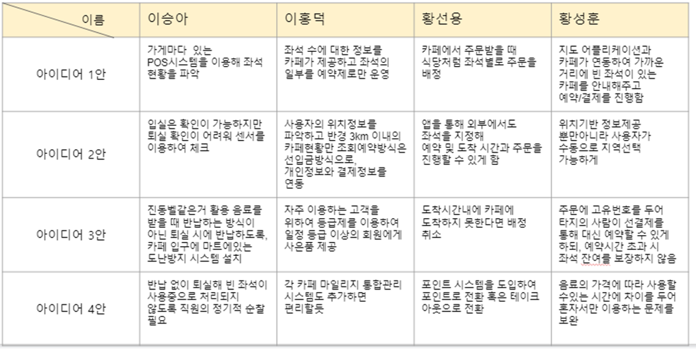
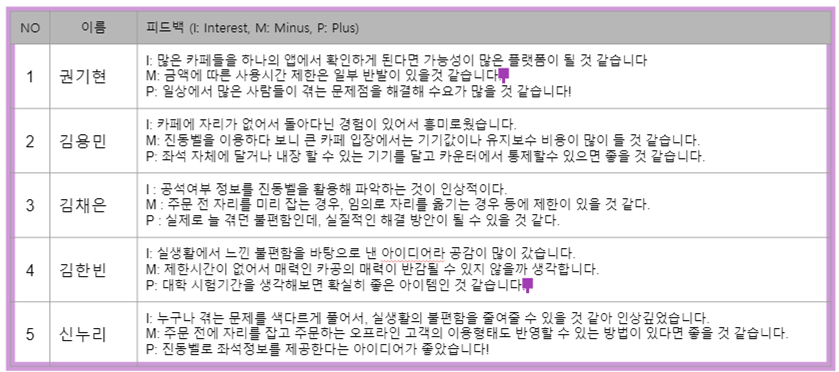

# 1. Design Thinking

> 'Design'이란 '실용적이고 기능적인 문제' 를 해결해나가는 과정이다.  'Design Thinking'은 이러한 사고 방식을 전반적인 비즈니스 문제 해결 과정에 도입하는 것을 일컫는다.

### 1-1. 디자인 씽킹 단계

- #### **공감** (Empathize)

**고객의 문제에 공감**하는 단계이다. 기술, 정치, 경제, 문화 등 다양한 분야에 대한 호기심을 바탕으로 사용자가 겪을 문제점을 사전에 예측할 수 있다. 

- #### 문제 정의 (Define)

공감단계에서 얻은 통찰을 바탕으로 진짜 **문제를 정의**하는 과정이다.  `페르소나 기법`을  활용하여 특정 고객이 겪는 **Pain Point를 발굴**하기도 한다.

- #### 아이디어 도출 (Ideate)

고객에게 적합한 **해결방안을 자유롭게 제시**하는 단계이다. **Pain Point 개선**을 중심으로 여러 사람들이 의견을 공유하고 발전시키는 단계이다. 

- #### 시제품 제작 (Prototype)

새로운 아이디어를 `프로토타입`으로 만들거나 `시나리오`를 만드는 단계이다.  **Quick & Dirty**한 방법으로 제품, 서비스에 대한 **아이디어를 구체화**한다.

- #### 테스트 (Test)

프로토타입에 대한 **고객의 피드백을 바탕으로 프로토타입을 개선**하는 단계이다. 이 과정을 반복하며 제품의 완성도를 높일 수 있다.

### 1-2. What I Learned 

✔  **항상 User 입장에서 SW를 기획하고 개발하는 개발자**가 되겠다 ✨✨✨✨✨✨✨✨✨

✔  창의 뒤에는 엄청난 노력이 있다. 다양한 분야의 지식을 길러 고객이 느낄 문제점을 빠르게 찾아내고 싶다.

✔  디자인 씽킹은 혼자하는 것이 아니다. 나만의 관점에서 벗어나, 다른 의견을 수용하는 법을 배웠다. 🤝

✔  디자인 씽킹의 기본 태도는 **긍정**이다 😁

✔  아이디어는 **양 > 질** 이다. 많은 아이디어가 나올 수록 결과물이 좋았다.

✔  페르소나, 고객여정지도, 브레인라이팅, 아이디어보드 등 다양한 툴로 체계적으로 사고하는 법을 배웠다.

---

# 2. Robot Coding

# 3. Game Coding

### 