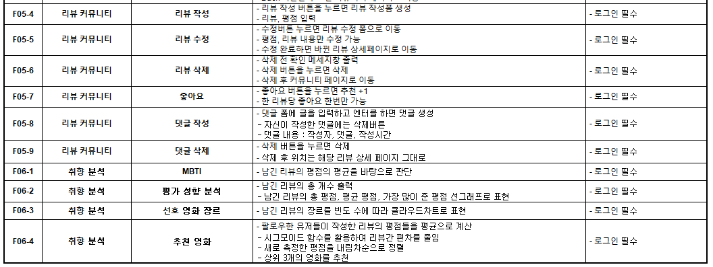

# 1. 개요

> 2학기는 자기주도형 프로젝트 형태로 협업을 통해 진행한다. 
>
> 따라서 협업에 필요한 다양한 개발 시스템, 도구를 활용해보는 실습을 하고자한다.

- 사용할 시스템 

  - GitLab (코드 관리 시스템)  
  - Jira(이슈 관리 시스템) 
  - Jenkins(빌드 자동화 도구)
  - sonarqube(정적 분석 도구)

  

# 2. 필수 지식

- #### GitLab (코드 관리 시스템)

버전 관리 시스템 (VCS)인 Git을 기반으로 저장소 및 단일 애플리케이션 개발에 필요한 기능을 제공하는 DevOps 플랫폼 중 하나이다. 

프로젝트별로 멤버를 지정하고 함께 프로젝트를 진행 할 수 있다.

Merge Request (MR)로 웹에서 쉽게 코드 리뷰를 진행할 수 있다. 

Activity, Commit 이력을 확인할 수 있고, JIRA & Mattermost 등 다양한 도구와 연동할 수 있다.

[Git의 기본 기능 살펴보기](https://git-scm.com/docs)

- #### JIRA (이슈 관리 시스템)

Atlassian에서 제공하는 이슈 관리 소프트웨어이다.

이슈로 정의할 수 있는 개발 항목들 (기능, 작업 단위, 버그 등) 을 관리하기에 좋은 툴이다.

JIRA는 주로 애자일 프로세스에 기반하여 쓰여진다.

- 이슈 유형 
  - `Epic`  : 최상위 수준의 기능/작업 단위
  - `Story` : Epic에 대한 하위 Level 수준의 기능/작업 단위
  - `Bug` : 프로젝트 개발/검증 중 발견된 버그
  - `Task` : 개발에 직접적으로 해당되진 않지만, Sprint안에 포함하여 할 일

- #### Jenkins (빌드 자동화 도구)

Jenkins는 CI (Continuous Integration)을 제공하는 도구이다.

빌드를 자동화하여 Git 저장소에 올리기 전, 버전 충돌과 같은 문제로 발생할 수도 있는 문제를 조기에 파악한다.

자동 배포 설정으로 통해 CD (Continuous Deploy) 도 가능하다.

# 3. 실습

- 기능 정의서 만들어보기

