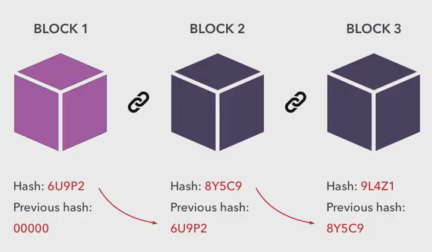
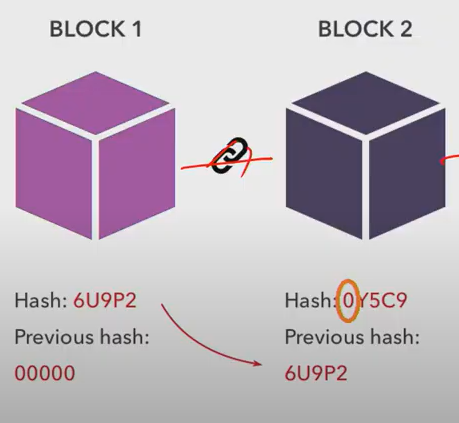
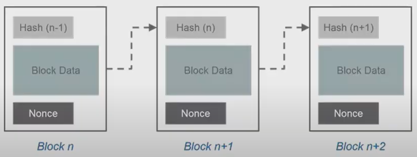
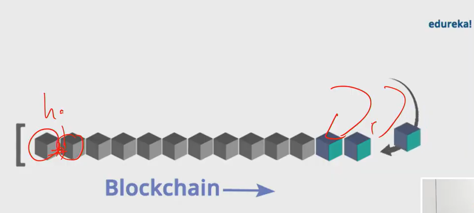

# 1. 개념

> **블록체인**은 관리할 데이터를 `블록`이라고 하는 소규모 데이터들을 `p2p` 방식을 기반으로 생성된 `체인` 형태의 `분산` 데이터 저장환경에 저장하는 기술이다.
>
>  그 누구라도 임의로 수정할 수 없고 누구나 변경의 결과를 열람할 수 있는 분산 컴퓨팅 기술 기반의 `원장` 관리 기술이다. 

# 2. Hash Function

> 단방향 암호화라고 할 수 있다. 암호화된 값으로 원래 값을 추론할 수 없다.
>
> (ex) %3 => 0, 1, 2 (결과가 1이면 원래 값이 무엇인지 알 수 없다.)
>
> 해싱된 값과 해시값을 가지고 있어야한다.

- #### Hash colligion (해시 충돌)

  입력값에 제한이 있다보면 한정된 길이 안에서 해시 중복이 일어날 수 있다.

- #### 활용

  Password, 

# 3. Simple Blockchain

- Block 1 : A 가 B 에게 500
- Block 2 : B가 A 에게 100
- 

# 4. Proof of Work (POW)

> Blockchain의 consensus protocol 중 하나
>
> 컴퓨팅 숙제를 냈을 때 해냈느냐, 못했느냐 판별

# 5. Nonce

Nonce를 조금씩 바꿔가면서 원하는 Hash값이 나오는지 확인한다. 

# 6. Block Mining

저장하고 싶은 데이터가 발생하면 nonce를 조금씩 바꾸며 믿을만한 block을 만들고, 성공하면 채굴!