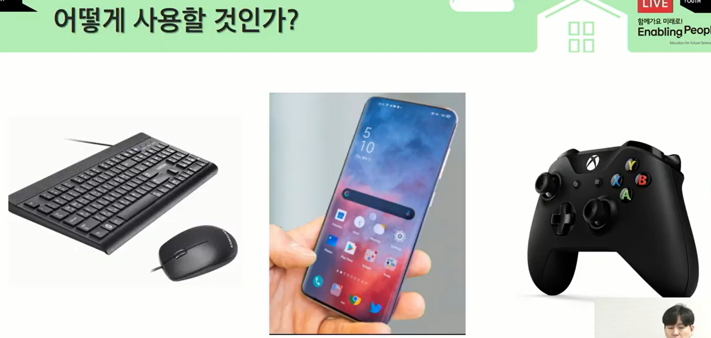
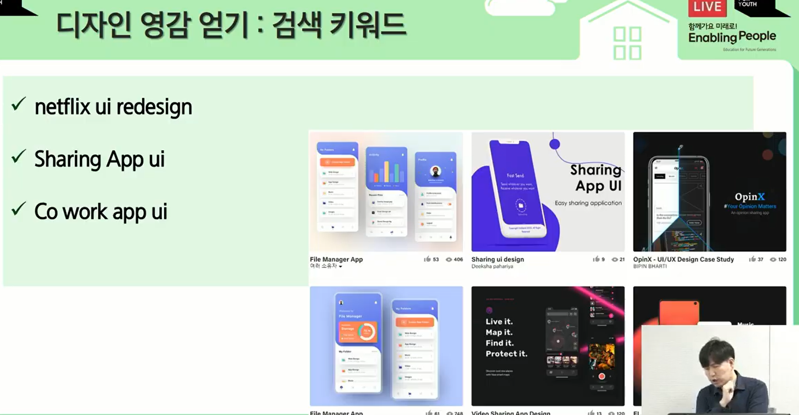

# UI / UX

UI : User Interface 사용자 상호작용

UX : User Experience 사용자 경험

-> UI/UX은 어느 플랫폼에서 누가 어떻게 사용할 것인가를 고민하는 일

설득력이 가장 중요!!!

UI  / UX 는 개발자의 기본 덕목!!!

- 개발 플랫폼별 UI 비교 (웹, 앱, 모바일, 게임)

- UI /UX 향상방법

 

