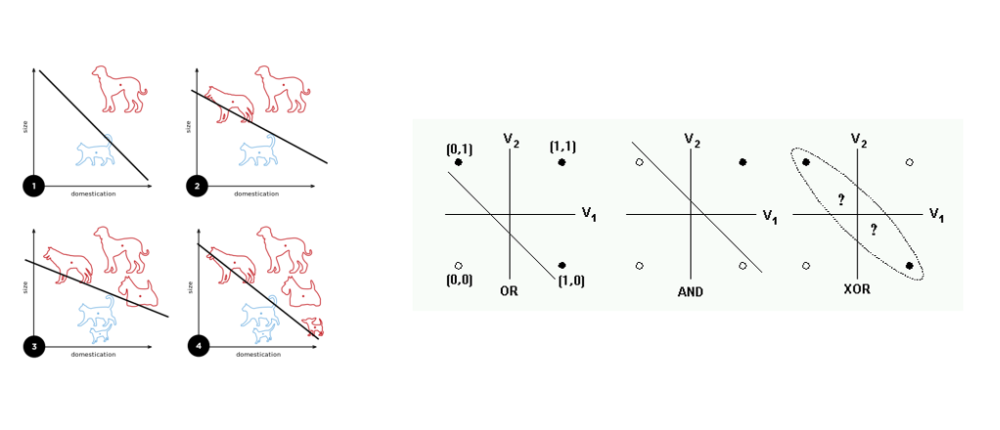
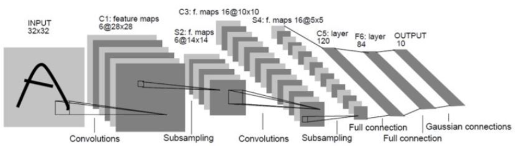
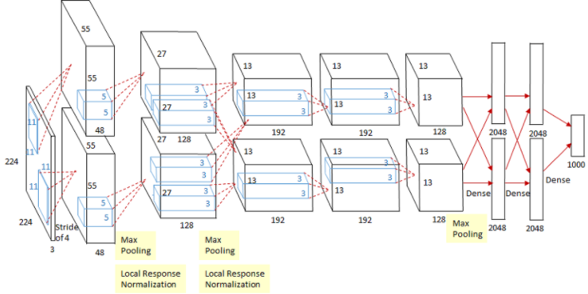

# AI

> 인공지능 사전학습 1강

### 01. 인공지능이란?

> 기계 지능을 다루는 컴퓨터 공학 분야이다. 인간 같은 인지능력을 구현하고 추론, 문제 해결, 계획, 이해 , 학습 그리고 패턴을 인식하게하는 목표를 가지고 있다. 

 

- #### **인공지능 역사**

1. **`퍼셉트론` Rosenblatt (1958)**

>  Input과 Output을 주었을 때 최초로 인공신경망을 구현한 기술이다. 단일 신경망을 모방한 기술이다. 

Input 과 Weight을 합성(Weighted Sum)하여 Output을 계산한다. Output이 일정 값을 넘으면 다음 단계에 신호를 보내고 일정 값을 넘지 않으면 그 신호를 버린다. 

✔ XOR 문제는 퍼셉트론만으로 구현하기 힘들다.  (선이 하나!!)

👉 선을 여러개 그어서 확인하면 되지 않을까?? NO!!! 생각보다 성능이 좋지 않았다!!

 

2. **`LeNet-5` (1998)**

> 첫번째 Convolution 기반 신경망이다. 일부 영역에 weight를 정해주고, window sliding하면서 재사용한다. 필요한 weight 수를 줄일 수 있고, 속도도 빨라지고 성능도 좋아졌다. 우편번호 인식에 큰 성공을 거두었다.

 

3. **`AlexNet` (2012)** 

> Convolution 기반 신경망이다. 기본구조는 LeNet-5와 크게 다르지 않지만, 2개의 GPU로 병렬연산을 수행하기 위한 구조로 설계되었다는 점이 가장 큰 차이이다. 

AlexNet은 ImageNet 챌린지 2012에서 큰 격차로 1등했다.  사람이 손수 짠 알고리즘보다 인공신경망의 알고리즘이 훨씬 우세했다. 데이터의 양도 많았고, 알고리즘이 발달했고, GPU를 사용했다.  

✔ AlexNet 이후로 Machine Learning (입력, 특징 추출, 분류, 출력) 에서 Deep Learning (입력, 특징 추출 & 분류, 출력) 으로 패러다임이 변화했다. 

✔ 사람보다 기계가 우수하다고 판단한다. 사람은 정보에 선입견을 가지고 있을 수도 있고 특정 정보를 놓칠 수도 있지만, 기계는 그렇지 않다. 

 

- ### 인공지능의 미래

> 사회성을 기른 인공지능이 중요해졌다. 사람은 Multi Modal로 사회성을 기른다. 인공지능에게도 지각능력을 통해 사회성을 학습하는 과정이 중요하다. 

- 기계가 학습을 하는 과정
  - 관찰 (Observe) : 현상을 관찰하고 상황을 파악한다. 관찰된 데이터를 모델에 넣어준다.
  - 이해 (Understand) :  경험, 지식을 기반으로 상황을 패턴화한다. 
  - 평가 (Evaluate) : 기준(사람 또는 시스템)에 의해서 평가한다. 평가 후에는 Loss / Reward 값이 생기고, Loss를 줄이고 Reward를 늘리는 최적화를 여러번 수행한다. 
  - 적용 (Deploy) : 최적화된 모델을 프로젝트에 적용한다. 

 

### 02. 기계학습이란?

> 경험사례 (data), 모델 (인공신경망), 평가기준이 필요하다.

- 계산/추론 (Computation / Inference)

함수를 주고 Output이 나오도록 계산한다.

- 최적화 (Optimization)

한 세트의 (input, output) 을 주고 관계를 가장 잘 설명하는 function을 찾는다.

- 일반화 (Generalization)

새로운  Input이 들어왔을 때도 올바른 Output이 나오도록 한다.

✔ 좋은 f(function) 이란? : 오차를 최소화한 f!!

 

- **최적화**	

  - `Gradient Decent (경사 하강법)` 

  > 기울기를 이용하여 가중치를 업데이트하는 방법이다.  급격하게 Loss가 작아지는 방향으로 가중치를 변화시키면서 Loss가 최소화되는 값을 찾는다. 

  - `Underfitting` 

  > 모델이 단순해서 데이터의 특징을 잘 나타내지 못한다.

  - `Overfitting`

  > 학습이 과도해서 데이터 하나하나의 특징을 모두 나타낸다. 

  👉 underfitting & overfitting 해결책 

  충분히 많은 양의 데이터를 사용한다. 모델의 복잡도를 줄인다. 가중치의 Regularization(억제)을 적용한다. 드롭아웃 (랜덤한 effect를 주는 트릭)을 한다.