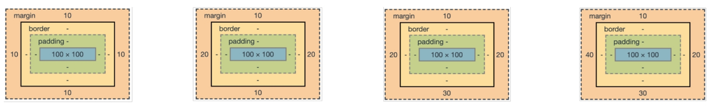

[TOC]

# 1. CSS

> **CSS : Cascading Style Sheets** 스타일, 레이아웃 등을 통해 문서(HTML)을 표시하는 방법을 지정한다.


### 1-1. CSS 구문

> 스타일을 지정할 html요소 (`선택자`)를 선택하고, **속성**과 **값**을 지정한다. 
>
> **속성** : 어떤 기능(글꼴, 너비, 배경색 등)을 변경할 지 나타낸다.
>
> **값** : 어떻게 기능을 변경할 건지 나타낸다.

```css
h1 {
   color: blue;
   font-size: 15px;
}
```

```
h1 : 선택자
color: blue; : 선언
font-size : 속성
15px : 값
```


---


### 1-2. CSS 정의 방법

- **인라인 (Inline)** : 해당 태그에 직접 `style` 속성을 넣는다.

```html
<h1 style="color: blue; font-size: 100px;">hello</h1>
```

- **내부 참조 (Embedding Style)** : head 태그 내에  `<style>`에 지정한다.

```html
<head>
    <style>
        h1 {
            color: blue;
            font-size: 15px;
        }   
    </style>
</head>
```

- **외부 참조 (Link Style)** : 외부 CSS 파일을 `<head>` 내 `<link>` 를 통해 불러오기

```html
<head>
	<link rel="stylesheet" href="mystyle.css">
</head>
```

```css
# mystyle.css

h1 {
    color: blue;
    font-size: 15px;
}
```


----


### 1-3. [CSS Selector (선택자)](https://developer.mozilla.org/en-US/docs/Web/CSS/CSS_Selectors)

> HTML 문서의 특정한 요소를 선택하여 스타일을 지정하기 위해 선택자를 사용한다.

- **클래스(class) 선택자** : `.` 로 시작하고 해당 클래스가 적용된 문서의 모든 항목을 선택한다.

```html
<!--기본 HTML-->
<div class="color" id="color">HELLO</div>
```

```css
div.color {color: green;}
```


- **아이디(id) 선택자** : `#`  로 시작하고 해당 id가 적용된 문서의 모든 항목을 선택한다. (단, id는 문서 당 한 번, 단일 id만 사용 가능,)

```css
div#color {color: green;}
```


- **복합 선택자**

  자손(**하위의 모든** 요소) : 셀렉터a  `공백` 셀렉터b (`A B`)

  자식(**바로 아래**의 요소) : 셀렉터a `>` 셀렉터b (`A > B`)

  

- **Pseudo-class selector (가상 클래스 셀렉터)** : `:` 를 이용하고, 요소의 특정 상태에 따라 스타일을 정의한다.

  `:nth-child()` : 타입과 상관없이 형제 사이에서의 순서에 따라 요소를 선택한다.

  `:nth-of-type()` : 타입과 일치하는 형제 사이에서의 순서에 따라 요소를 선택한다.


- [**적용 우선순위**](https://developer.mozilla.org/ko/docs/Learn/CSS/Building_blocks/Cascade_and_inheritance)

1. `!important` :  반드시 필요한 경우에만 사용하기! ( cascading이 작동하는 방식을 변경해서 CSS스타일 문제를 해결하기 어렵다!)
2. `inline style` 
3. `id 선택자` :  문서 내 `링크 이동`이나 `for`를 사용하는 특별한 경우에만 아이디를 사용한다.
4. `class 선택자`
5. `요소 선택자`
6. `소스 순서`


---


### 1-4. [CSS 상속](https://developer.mozilla.org/ko/docs/Web/CSS/inheritance)

> CSS는 상속을 통해 부모 요소의 속성을 자식에게 상속한다.

- 상속 되는 것 : Text (font, colot, text-align), opacity, visibility 등

- 상속 되지 않는 것 : Box model (width, height, margin, padding, border, box-sizing, display)

  ​								position (position, top, right, bottom, left, z-index)


---


### 1-5. CSS 단위

- **크기 단위**

`px` : 픽셀의 크기는 변하지 않기 때문에 **고정적인 단위**이다.

`%`: **백분율 단위**이다. **가변적인 레이아웃**에서 자주 사용한다.

`em` : em은 상속의 영향을 받기 때문에, 상황에 따라 각기 다른 값을 가질 수 있다.

`rem` : 최상위 요소인 `html`을  기준으로 삼아, 상속에 영항을 받지 않기 때문에 주로 `rem`을 사용한다.

`viewport 기준 단위` : (스크롤을 내리지 않은 상태에서) 웹 페이지를 방문한 유저에게 현재 보이는 웹 컨텐츠의 영역이다. 주로 스마트폰이나 테블릿 디바이스의 화면을 일컫는 용어로 사용된다. ( `vw` , `vh` , `vmin` , `vmax` )


- **색상 표현 단위**

1. 색상 키워드 :  대소문자를 구분하지 않는 식별자로, red, blue, black처럼 특정 색을 나타낸다

2. RGB 색상 : 16진수 표기법 (`#000000`) 이나 함수형 표기법 (`rgb(0, 0, 0)`)으로 사용한다. a는 alpha(투명도)가 추가된 것이다.

3. HSL 색상 : 함수형 표기법 (`hsla(120, 100%, 0)`) 으로 사용한다. a는 alpha(투명도)가 추가된 것이다.


---


### 1-6. CSS Box model

> 웹 디자인은 contents를 담을 box model을 정의하고 CSS 속성을 통해 스타일과 위치 및 정렬을 지정하는 것이다. 모든 HTML 요소는 box 형태이다. 하나의 박스는 ( `content`, `padding`, `borde`, `margin` )으로 이루어져 있다.


`Content` : 글이나 이미지, 비디오 등 요소의 실제 내용이다.

`Padding (안쪽 여백)` : Border안, 내부 여백이다. 배경색, 이미지 지정이 가능하다.

`Border (테두리)`

`Margin (바깥쪽 여백)` : Border 밖, 외부 여백이다. 배경색 지정이 불가능하다.


**(참고) Shorthand**



```CSS
.margin-1{
    margin: 10px;
}
=> 상하좌우 10px

.margin-2{
    margin: 10px 20px;
}
=> 상하 10px 좌우 20px

.margin-3{
    margin: 10px 20px 30px;
}
=> 상 10px 좌우 20px 하 30px

.margin-4{
    margin: 10px 20px 30px 40px;
}
=> 상 10px 우 20px 하 20px 좌 40px

.border{
    border: 2px dashed black;
}
```


- **Box-sizing**

box-sizing을 border-box로 설정하면, 우리가 일반적으로 생각하는 박스 (border 내 영역) 영역을 조절할 수 있다.


- **마진 상쇄**

margin이 때로는 결합되는 마진 중에서 크기가 가장 큰 한 마진으로 `결합(combine)`, `상쇄(collapsed)` 되는 현상이다.


---


### 1-7. [Display CSS](https://developer.mozilla.org/ko/docs/Web/CSS/display)

> display CSS 속성은 요소를 블록과 인라인 요소 중 어느 쪽으로 처리할지와 함께 자식 요소를 배치할 때 사용할 레이아웃을 설정한다.

- [**display: block**](https://developer.mozilla.org/ko/docs/Web/HTML/Block-level_elements) 

  **줄 바꿈**이 일어나고, **화면 전체 크기의 가로 폭**을 차지한다. 블럭안에 인라인 요소가 들어갈 수 있다.

- **[display: inline](https://developer.mozilla.org/ko/docs/Web/HTML/Inline_elements)** 

  줄 바꿈이 일어나지 않고, **content 너비만큼 가로 폭**을 차지한다. 

  width, height, margin-top, margin-bottom을 지정할 수 없다. 대신, 상하 여백은 `line-height`로 지정한다.

  |            | disply: block                          | display: inline    |
  | ---------- | -------------------------------------- | ------------------ |
  | 좌측정렬   | margin-right: auto                     | text-align: left   |
  | 우측정렬   | margin-left: auto                      | text-align: right  |
  | 가운데정렬 | margin-right: auto & margin-left: auto | text-align: center |

- **display: inline-block**

  inline 처럼 한 줄에 표시가 가능하고, block처럼 width, height, margin 속성을 지정할 수 있다.

- **display: none**

  해당 요소를 화면에서 사라지게 하며 요소의 공간조차 사라지게 한다.

  **(참고)** `visibility: hidden;` : 해당 요소를 화면에서 사라지게는 하나 공간은 사라지지 않는다.


---


### 1-8. Position

- **static (기준 위치)** : **요소의 디폴트 값**에 따른다. 부모 요소 내에서는 부모 요소 위치를 기준으로 배치된다. 

- **relative (상대 위치)** : **static을 기준**으로 좌표 속성 (top, bottom, left, right)을 사용해 **위치 이동이 가능**하다.

- **absolute (절대 위치)** : static 이 아닌 **부모/조상 요소를 기준**으로 삼는다. **부모가 없으면, body**를 기준으로 한다.

- **fixed (고정 위치)** : **부모/조상 요소와 관계없이 브라우저의 viewport를 기준**으로 좌표 속성 만큼 이동한다. 따라서, 스크롤을 내리거나 올려도 항상 같은 곳에 위치한다. 


