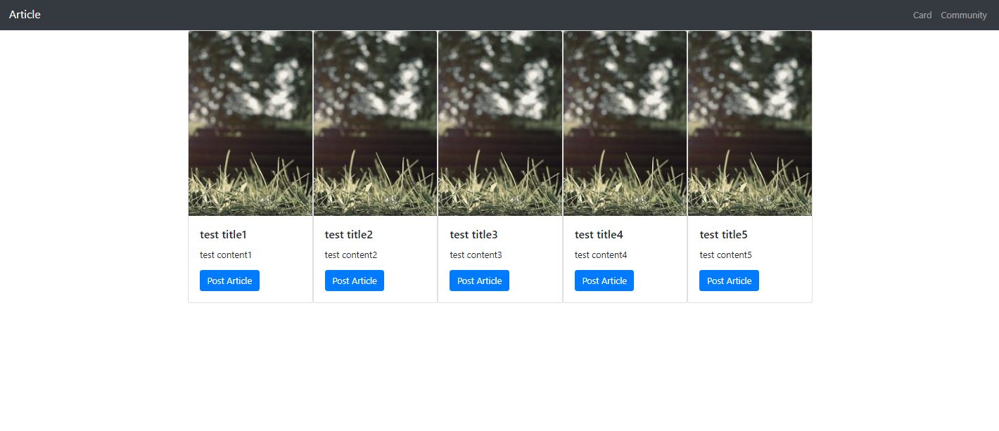

# 0819_Workshop

### 1. intro/settings.py

```python
# pages 앱 추가
INSTALLED_APPS = [
    'pages',
    'django.contrib.admin',
    'django.contrib.auth',
    'django.contrib.contenttypes',
    'django.contrib.sessions',
    'django.contrib.messages',
    'django.contrib.staticfiles',
]

# base.html 경로 설정
TEMPLATES = [
    {
        'BACKEND': 'django.template.backends.django.DjangoTemplates',
        'DIRS': [BASE_DIR / 'intro' / 'templates'],
        'APP_DIRS': True,
        'OPTIONS': {
            'context_processors': [
                'django.template.context_processors.debug',
                'django.template.context_processors.request',
                'django.contrib.auth.context_processors.auth',
                'django.contrib.messages.context_processors.messages',
            ],
        },
    },
]

# 기본 설정
LANGUAGE_CODE = 'ko-kr'
TIME_ZONE = 'Asia/Seoul'
```


### 2. intro/urls.py

```python
from django.contrib import admin
from django.urls import path, include

urlpatterns = [
    path('admin/', admin.site.urls),
    path('pages/', include('pages.urls'))
]
```

### 	pages/urls.py

```python
from django.urls import path
from . import views

app_name = 'pages'

urlpatterns = [
    path('card/', views.card, name='card'),
    path('community/', views.community, name='community'),
]
```


### 3. pages/views.py

```python
from django.shortcuts import render

# Create your views here.
def card(request):
    articles = [
    ['test title1', 'test content1'],
    ['test title2', 'test content2'],
    ['test title3', 'test content3'],
    ['test title4', 'test content4'],
    ['test title5', 'test content5'],
    ]

    context = {
        'articles' : articles
    }
    
    return render(request, 'pages/card.html', context)


def community(request):
    articles = [
    ['#', 'Title', 'Content', 'Creation Time'],
    ['test title 1', 'test content 1', 'test creation time1'],
    ['test title 2', 'test content 2', 'test creation time2'],
    ['test title 3', 'test content 3', 'test creation time3'],
    ['test title 4', 'test content 4', 'test creation time4'],
    ['test title 5', 'test content 5', 'test creation time5'],
    ['test title 6', 'test content 6', 'test creation time6'],
    ]

    context = {
        'articles' : articles
    }
    
    return render(request, 'pages/community.html', context)
```


### 4. intro/templates/base.html

```html
<!DOCTYPE html>
<html lang="en">
<head>
    <meta charset="UTF-8">
    <meta name="viewport" content="width=device-width, initial-scale=1.0">
    <link rel="stylesheet" href="https://stackpath.bootstrapcdn.com/bootstrap/4.5.2/css/bootstrap.min.css" integrity="sha384-JcKb8q3iqJ61gNV9KGb8thSsNjpSL0n8PARn9HuZOnIxN0hoP+VmmDGMN5t9UJ0Z" crossorigin="anonymous">
    <title>Document</title>
</head>
<body>
    <!-- 상속할 navbar -->
    <nav class="navbar navbar-expand-lg navbar-dark bg-dark">
        <a class="navbar-brand" href="#">Article</a>
         <button class="navbar-toggler" type="button" data-toggle="collapse" data-target="#navbarNavAltMarkup" aria-controls="navbarNavAltMarkup" aria-expanded="false" aria-label="Toggle navigation">
            <span class="navbar-toggler-icon"></span>
        </button>
        <div class="d-flex justify-content-end collapse navbar-collapse" id="navbarNavAltMarkup">
            <div class="navbar-nav ">
                <a class="nav-item nav-link" href="../card/">Card</a>
                <a class="nav-item nav-link" href="../community">Community</a>
            </div>
        </div>
    </nav>
    <!-- 각 페이지마다 새롭게 정해줄 부분 -->
    <div class="container d-flex mx-auto">
        
        
    </div>


    <script src="https://code.jquery.com/jquery-3.5.1.slim.min.js" integrity="sha384-DfXdz2htPH0lsSSs5nCTpuj/zy4C+OGpamoFVy38MVBnE+IbbVYUew+OrCXaRkfj" crossorigin="anonymous"></script>
    <script src="https://cdn.jsdelivr.net/npm/popper.js@1.16.1/dist/umd/popper.min.js" integrity="sha384-9/reFTGAW83EW2RDu2S0VKaIzap3H66lZH81PoYlFhbGU+6BZp6G7niu735Sk7lN" crossorigin="anonymous"></script>
    <script src="https://stackpath.bootstrapcdn.com/bootstrap/4.5.2/js/bootstrap.min.js" integrity="sha384-B4gt1jrGC7Jh4AgTPSdUtOBvfO8shuf57BaghqFfPlYxofvL8/KUEfYiJOMMV+rV" crossorigin="anonymous"></script>
</body>
</html>
```


### 5. pages/templates/card.html

```html






    
    <div class="card" style="width: 18rem;">
        
    <div class="card-body">
        <h5 class="card-title">{{ article.0 }}</h5>
        <p class="card-text">{{ article.1 }}</p>
        <a href="../community" class="btn btn-primary">Post Article</a>
    </div>
    </div>
       
    


```


### 6. pages/templates/community.html

```html




    <table class="table">
      
        
            <thead>
                <tr>
                <th scope="col">{{ article.0 }}</th>
                <th scope="col">{{ article.1 }}</th>
                <th scope="col">{{ article.2 }}</th>
                <th scope="col">{{ article.3 }}</th>
                </tr>
            </thead>
            
            <tbody>
                <tr>
                    <th scope="row">{{forloop.counter0 }}</th>
                    <td>{{ article.0 }}</td>
                    <td>{{ article.1 }}</td>
                    <td>{{ article.2 }}</td>
                </tr>
            </tbody>
            
        
    </table>


```


---


### 결과화면

### pages/card




### pages/community

