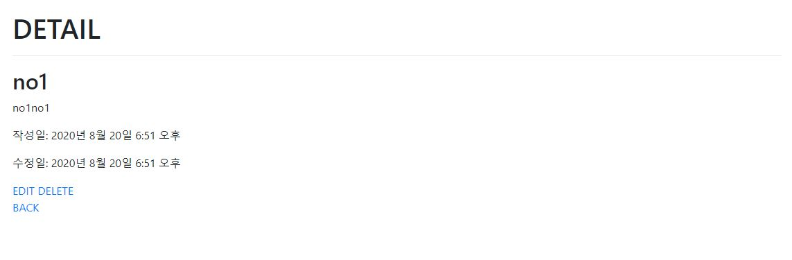
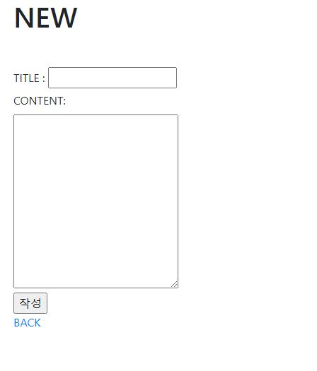
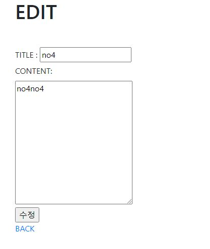

# 0820_workshop		

### 1. 기본 설정

- base.html

```html
<!DOCTYPE html>
<html lang="en">
<head>
    <meta charset="UTF-8">
    <meta name="viewport" content="width=device-width, initial-scale=1.0">
    <!-- Bootstrap CSS -->
    <link rel="stylesheet" href="https://stackpath.bootstrapcdn.com/bootstrap/4.5.2/css/bootstrap.min.css" integrity="sha384-JcKb8q3iqJ61gNV9KGb8thSsNjpSL0n8PARn9HuZOnIxN0hoP+VmmDGMN5t9UJ0Z" crossorigin="anonymous">
    <title>Document</title>
</head>
<body>
    <div class="container mb-5">
        
        
    </div>
    <div class="container">
        
        
    </div>
    
    <!--Bootstrap JS-->
    <script src="https://code.jquery.com/jquery-3.5.1.slim.min.js" integrity="sha384-DfXdz2htPH0lsSSs5nCTpuj/zy4C+OGpamoFVy38MVBnE+IbbVYUew+OrCXaRkfj" crossorigin="anonymous"></script>
    <script src="https://cdn.jsdelivr.net/npm/popper.js@1.16.1/dist/umd/popper.min.js" integrity="sha384-9/reFTGAW83EW2RDu2S0VKaIzap3H66lZH81PoYlFhbGU+6BZp6G7niu735Sk7lN" crossorigin="anonymous"></script>
    <script src="https://stackpath.bootstrapcdn.com/bootstrap/4.5.2/js/bootstrap.min.js" integrity="sha384-B4gt1jrGC7Jh4AgTPSdUtOBvfO8shuf57BaghqFfPlYxofvL8/KUEfYiJOMMV+rV" crossorigin="anonymous"></script>
</body>
</html>
```

- models.py

```python
from django.db import models

# Create your models here.
class Article(models.Model):
    title = models.CharField(max_length=10)
    content = models.TextField()
    created_at = models.DateTimeField(auto_now_add=True)
    updated_at = models.DateTimeField(auto_now=True)
```

- urls.py (crud)

```python
from django.contrib import admin
from django.urls import path, include

urlpatterns = [
    path('admin/', admin.site.urls),
    path('articles/', include('articles.urls')),
]
```

- urls.py (articles)

```python
from django.urls import path
from . import views

app_name = 'articles'
urlpatterns = [
   # READ
   path('', views.index, name='index'),
   path('<int:pk>/', views.detail, name='detail'),
   
   # CREATE
   path('new/', views.new, name='new'),
   path('create/', views.create, name='create'),
  
   # UPDATE
   path('<int:pk>/edit/', views.edit, name='edit'),
   path('<int:pk>/updatd/', views.update, name='update'),
    
   # DELETE 
   path('<int:pk>/delete/', views.delete, name='delete'),
]
```

- views.py

```python
from django.shortcuts import render, redirect
from .models import Article

# 초기 화면
def index(request):
    articles = Article.objects.all()
    context = {
        'articles' : articles,
    }
    return render(request, 'articles/index.html', context)


# 게시물 상세페이지
def detail(request, pk):
    article = Article.objects.get(pk=pk)
    context = {
        'article' : article,
    }
    return render(request,'articles/detail.html', context)


# 게시글 작성 폼으로 ㄱㄱ 
def new(request):
    return render(request, 'articles/new.html')


# 폼의 데이터를 DB에 저장
def create(request):
    title = request.POST.get('title')
    content = request.POST.get('content')
    article = Article.objects.create(title=title, content=content)
    return redirect('articles:detail', article.pk)


# 수정할 게시글 폼으로 ㄱㄱ
def edit(request, pk):
    article = Article.objects.get(pk=pk)
    context = {
        'article' : article
    }
    return render(request,'articles/edit.html', context)


# 수정한 폼의 데이터를 DB에 저장
def update(request, pk):
    article = Article.objects.get(pk=pk)
    article.title = request.POST.get('title')
    article.content = request.POST.get('content')
    article.save()
    return redirect('articles:detail', article.pk)    


# 게시글 삭제
def delete(request, pk):
    article = Article.objects.get(pk=pk)
    article.delete()
    return redirect('articles:index')
```


---


### 2. READ

- index.html

```html



    <h1>INDEX</h1>
    <a href="">NEW</a>



    
        <h2>제목 : {{ article.title }}</h2>
        <p>내용 : {{ article.content }}</p>
        <a href="" class="mt-5">DETAIL</a>
        <hr>
        

```


- detail.html

```html



<h1>DETAIL</h1>
<hr>
<h2>{{ article.title }}</h2>
<p>{{ article.content }}</p>
<p>작성일: {{ article.created_at }}</p>
<p>수정일: {{ article.updated_at }}</p>

<a href="">EDIT</a>
<a href="">DELETE</a><br>
<a href="">BACK</a>

```




---


### 3. CREATE

- new.html

```html



<h1>NEW</h1>



<form action="" method="POST">
    
    <label for="title">TITLE : </label>
    <input type="text" name="title" id="title"><br>
    <label for="content">CONTENT: </label><br>
    <textarea name="content" id="content" cols="30" rows="10"></textarea><br>
    <input type="submit" value="작성">
</form>
<a href="">BACK</a>

```



---

### 

### 4. UPDATE

- edit.html

```html



<form action="" method="POST">
    
    <label for="title">TITLE : </label>
    <input type="text" name="title" id="title" value="{{ article.title }}"><br>
    <label for="content">CONTENT: </label><br>
    <textarea name="content" id="content" cols="30" rows="10">{{ article.content }}</textarea><br>
    <input type="submit" value="수정">
</form>
<a href="">BACK</a>

```



---


### 5. DELETE

- views.py

```python
# 게시글 삭제
def delete(request, pk):
    article = Article.objects.get(pk=pk)
    article.delete()
    return redirect('articles:index')
```

