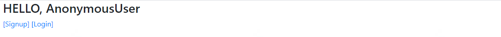

# 0917_homework

#### 1. User Model BooleanField

> django에서 기본적으로 사용하는 User 모델은 AbstractUser 모델을 상속받아 정의된다. 아래의 models.py를 참고하여 User모델에서 사용할 수 있는 칼럼 중 BooleanField로 정의된 칼럼을 모두 작성하시오.

```python
class User(AbstractUser):
    """
    Users within the Django authentication system are represented by this
    model.
    Username and password are required. Other fields are optional.
    """
    class Meta(AbstractUser.Meta):
        swappable = 'AUTH_USER_MODEL'
```

```python
is_staff = models.BooleanField(
        _('staff status'),
        default=False,
        help_text=_('Designates whether the user can log into this admin site.'),
    )
is_active = models.BooleanField(
        _('active'),
        default=True,
        help_text=_(
            'Designates whether this user should be treated as active. '
            'Unselect this instead of deleting accounts.'
        ),
    )
is_superuser = models.BooleanField(
        _('superuser status'),
        default=False,
        help_text=_(
            'Designates that this user has all permissions without '
            'explicitly assigning them.'
        ),
    )
```

👉 is_staff, is_active, is_superuser

---

#### 2. username max Length

> django에서 기본적으로 사용하는 User 모델의 사용할 수 있는 칼럼 중 username에 저장할 수 있는 최대 길이를 작성하시오.

```python
username = models.CharField(
        _('username'),
        max_length=150,
        unique=True,
        help_text=_('Required. 150 characters or fewer. Letters, digits and @/./+/-/_ only.'),
        validators=[username_validator],
        error_messages={
            'unique': _("A user with that username already exists."),
        },
    )
```

👉 max_length = 150

---

#### 3. login validation

> 로그인 했는지 확인하기 위하여 User 모델 내부에 정의된 속성의 이름을 작성하시오.

```python
 def is_authenticated(self):
        """
        Always return True. This is a way to tell if the user has been
        authenticated in templates.
        """
        return True
```

👉 is_authenticated()

---

#### 4. Login

> 다음은 로그인 기능을 구현한 코드이다. 빈 칸에 들어갈 코드를 작성하시오.

```python
from django.contrib.auth.forms import __(a)__
from django.contrib.auth import __(b)__ as auth_login


def login(request):
    if request.method == 'POST':
        form = __(a)__(request, request.POST)
        if form.is_valid():
            auth_login(request, __(c)__)
            # redirect -> 'GET'요청으로 처리됨
            return redirect(request.GET.get('next') or 'articles:index')
    else:
        form = __(a)__()
    context = {
        'form': form,
    }    
    return render(request, 'accounts/login.html', context)
```

(a) : AuthenticationForm

(b) : login

(C) : form.get_user()

---

#### 5. who are you?

> 로그인을 하지 않았을 경우 template에서 user 변수를 출력했을 때 나오는 클래스의 이름을 작성하시오.

```python
class AnonymousUser:
    id = None
    pk = None
    username = ''
    is_staff = False
    is_active = False
    is_superuser = False
    _groups = EmptyManager(Group)
    _user_permissions = EmptyManager(Permission)
	...
    생략
```



👉 AnonymousUser 클래스

---

#### 6. 암호화 알고리즘

> Django에서 기본적으로 User 객체의 password 저장에 사용하는 알고리즘, 그리고 함께 사용된 해시 함수를 작성하시오.

👉 PBKDF2 알고리즘, SHA256 해시함수

---

#### 7. Logout

> 로그아웃 기능을 구현하기 위하여 다음과 같이 코드를 작성하였다. 로그아웃 기능을 실행 시 문제가 발생한다고 할 때 그 이유와 해결 방법을 작성하시오.

```python
def logout(request):
    logout(request)
    return redirect('accounts:login')
```

👉  정의한 logout 함수와 django.contrib.auth에서 import한 logout의 이름이 같아서 문제가 발생한다.

따라서, import 할 때 따로 사용할 이름을 지정해주어야한다.

```python
from django.contrib.auth import logout as auth_logout

def logout(request):
    auth_logout(request)
    return redirect('accounts:login')
```

