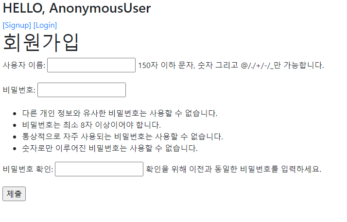
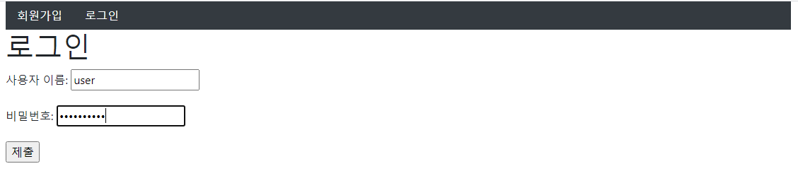
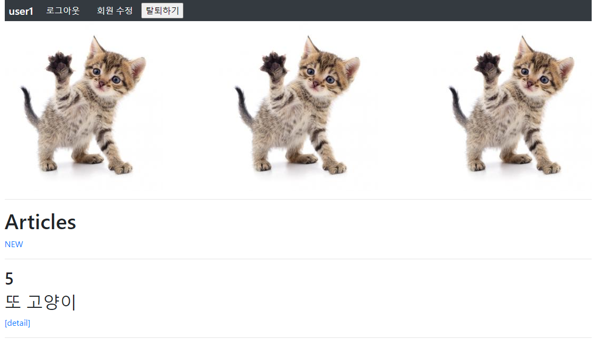
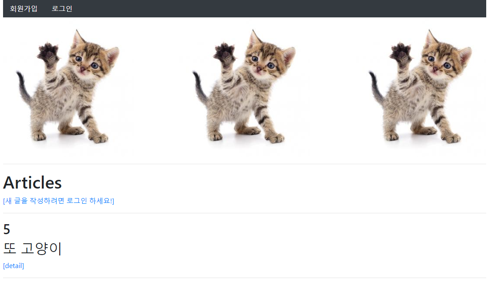
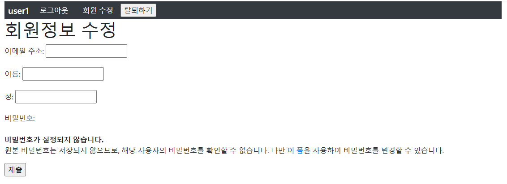

# 0917_practice

### 1. User Create

> /accounts/signup/ 회원가입 기능을 구현한다.

```python
# views.py
from django.shortcuts import render, redirect
from django.contrib.auth.forms import UserCreationForm
from django.contrib.auth import login as auth_login

def signup(request):
    if request.user.is_authenticated: 
        return redirect('articles:index')

    if request.method =='POST':
        form = UserCreationForm(request.POST)
        if form.is_valid():
            user = form.save()           
            auth_login(request, user)
            return redirect('articles:index')
    else:
        form = UserCreationForm()
    context = {
        'form': form,
    }    
    return render(request, 'accounts/signup.html', context)
```



---

#### 2. Login

> /accounts/login/ 로그인 기능을 구현한다. 
>
> 로그인을 한 경우, nav에 다음과 같은 정보가 표시된다.
>
> 1) 로그인 한 유저 정보 2) 로그아웃 3) 회원 수정 4) 회원 탈퇴

```python
# views.py
from django.shortcuts import render, redirect
from django.contrib.auth.forms import AuthenticationForm
from django.contrib.auth import login as auth_login

def login(request):
    if request.user.is_authenticated:
        return redirect('articles:index')

    if request.method == 'POST':
        form = AuthenticationForm(request, request.POST)       
        if form.is_valid():
            auth_login(request, form.get_user())           
            return redirect(request.GET.get('next') or 'articles:index')
    else:
        form = AuthenticationForm()
    context = {
        'form': form,
    }    
    return render(request, 'accounts/login.html', context)
```

```html
# base.html
<nav class="nav bg-dark d-flex align-items-center">
    
      <h5 class="text-white m-2">{{ user }}</h5>
      <a class="nav-link text-white" href="">로그아웃</a>
      <a class="nav-link text-white" href="">회원 수정</a>
      <form action="" method="POST">
          
          <input type="submit" value="탈퇴하기">
      </form>
    
      <a class="nav-link active" href="">회원가입</a>
      <a class="nav-link" href="">로그인</a>
    
</nav>
```





---

#### 3. Logout

>/accounts/logout/ 로그아웃 기능을 구현한다.
>
>로그아웃을 한 경우, nav에 다음과 같은 정보가 표시된다.
>
>1) 회원가입 2)로그인

```python
# views.py
from django.shortcuts import render, redirect
from django.contrib.auth import logout as auth_logout

def logout(request):
    auth_logout(request)
    return redirect('articles:index')
```



---

#### 4. User Update

> /accounts/update/ 회원 정보 수정 기능을 구현한다
>
> 회원 정보 수정 페이지에서는 아래의 정보만 수정 할 수 있도록 설정한다.
>
> 1) 이메일 주소 2) 이름, 성

```python
# views.py
from django.shortcuts import render, redirect
from django.contrib.auth.decorators import login_required
from .forms import CustomUserChangeForm

@login_required
def update(request):
    if request.method == 'POST':
        form = CustomUserChangeForm(request.POST, instance=request.user)
        if form.is_valid():
            form.save()
            return redirect('articles:index')
    else:
        form = CustomUserChangeForm(instance=request.user)
    context = {
        'form': form,
    }
    return render(request, 'accounts/update.html', context)
```

```python
# forms.py
from django.contrib.auth import get_user_model
from django.contrib.auth.forms import UserChangeForm

class CustomUserChangeForm(UserChangeForm):
    
    class Meta:
        model = get_user_model()
        fields = ('email', 'first_name', 'last_name',)
```



---

#### 5.  User Delete

> /accounts/delete/ 회원 삭제 기능을 구현한다.
>
> 단, POST 요청일 때만 삭제할 수 있도록 작성한다.

```python
# views.py
from django.shortcuts import render, redirect
from django.views.decorators.http import require_POST

@require_POST
def delete(request):
    if request.user.is_authenticated:
        request.user.delete()
        return redirect('articles:index')
```

