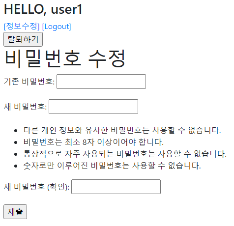

# 0917_workshop

### 1. Password Change

> /accounts/password/ 비밀번호 수정 기능을 구현한다.

```python
# views.py
from django.shortcuts import render, redirect
from django.contrib.auth.decorators import login_required
from django.contrib.auth.forms import PasswordChangeForm
from django.contrib.auth import update_session_auth_hash

@login_required
def password(request):
    if request.method == 'POST':
        form = PasswordChangeForm(request.user, request.POST)
        if form.is_valid():
            user = form.save()
            # 비밀번호를 변경해도 세션을 유지하여 로그인 상태 유지
            update_session_auth_hash(request, user)
        return redirect('articles:index')
    else:
        form = PasswordChangeForm(request.user)
    context = {
        'form': form,
    }
    return render(request, 'accounts/password.html', context)
```

```html
# password.html




<h1>비밀번호 수정</h1>
<form action="" method="POST">
    
    {{ form.as_p }}
    <input type="submit">
</form>

```




