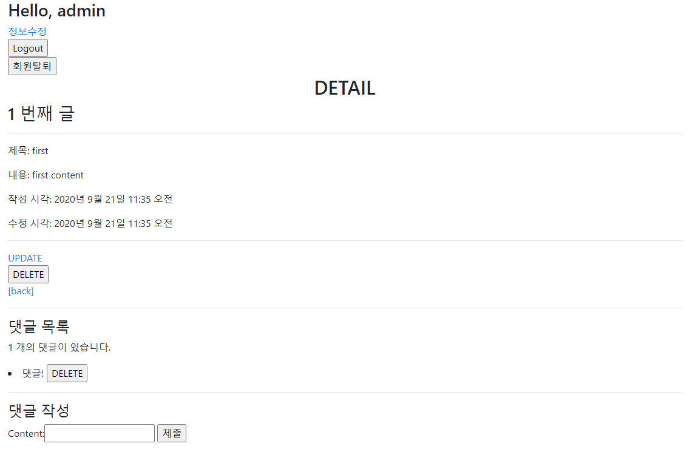

# 0921_workshop

### 1. Model

> 댓글 작성을 위한 테이블을 정의한다.

```python
# models.py
class Comment(models.Model):
    article = models.ForeignKey(Article, on_delete=models.CASCADE)
    content = models.CharField(max_length=200)
    created_at = models.DateTimeField(auto_now_add=True)
    updated_at = models.DateTimeField(auto_now=True)

    def __str__(self):
        return self.content
```

---

### 2. Comment Create

> /articles/<article_pk>/comments/ 댓글 작성 기능을 구현한다.

```python
# views.py
from django.shortcuts import render, redirect
from django.views.decorators.http import require_POST
from .models import Article, Comment
from .forms import ArticleForm, CommentForm


@require_POST
def comments_create(request, pk):
        article = Article.objects.get(pk=pk)
        comment_form = CommentForm(request.POST)
        if comment_form.is_valid():
            # Create, but don't save the new author instance.
            comment = comment_form.save(commit=False)
            comment.article = article
            comment.save()
            return redirect('articles:detail', article.pk)
        context = {
            'article': article,
            'comment_form': comment_form,
        }
        return render(request, 'articles/detail.html', context)
```

```html
<!--detail.html-->
<!--생략-->

<h4>댓글 작성</h4>
  <form action="" method="POST">
    
    {{ comment_form }}
    <input type="submit">
  </form>
```

---

### 3. Comment Read

> 댓글 읽기 기능을 구현한다. 상세 페이지 하단에 댓글 목록을 출력한다.

```python
# views.py
from django.shortcuts import render, redirect, get_object_or_404
from .models import Article, Comment
from .forms import ArticleForm, CommentForm

def detail(request, pk):
	# 정확한 오류 메세지 출력을 위해 get_object_or_404를 쓴다.
    article = get_object_or_404(Article, pk=pk)
    comment_form = CommentForm()
    comments = article.comment_set.all()
    context = {
        'article': article,
        'comment_form': comment_form,
        'comments': comments,
    }
    return render(request, 'articles/detail.html', context)
```

```html
<!--detail.html-->
<!--생략-->

<h4>댓글 목록</h4>
  
    <p>{{ comments|length }} 개의 댓글이 있습니다.</p>
    
  
    <li>
      {{ comment.content }}
      <form action="" method="POST" class="d-inline">
        
        <input type="submit" value="DELETE">
      </form>
    </li>
  
    <p>댓글이 아직 없어요..</p>
  
```

---

### 4. Comment Delete

> /articles/<article_pk>/ comments/<comment_pk>/delete/ 댓글 삭제 기능을 구현한다.

```python
# views.py
from django.shortcuts import render, redirect, get_object_or_404
from django.views.decorators.http import require_POST
from .models import Article, Comment
from .forms import ArticleForm, CommentForm


@require_POST
def comments_delete(request, article_pk, comment_pk):
    comment = get_object_or_404(Comment, pk=comment_pk)
    comment.delete()
    return redirect('articles:detail', article_pk)
```

