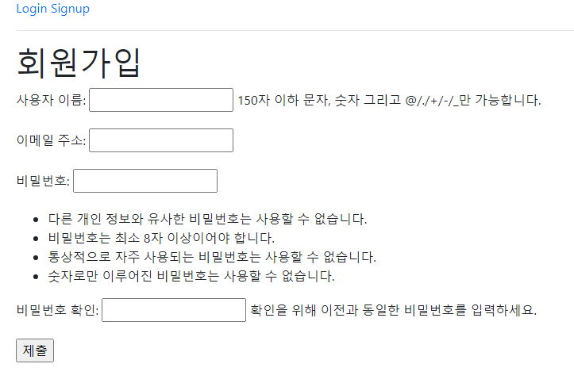
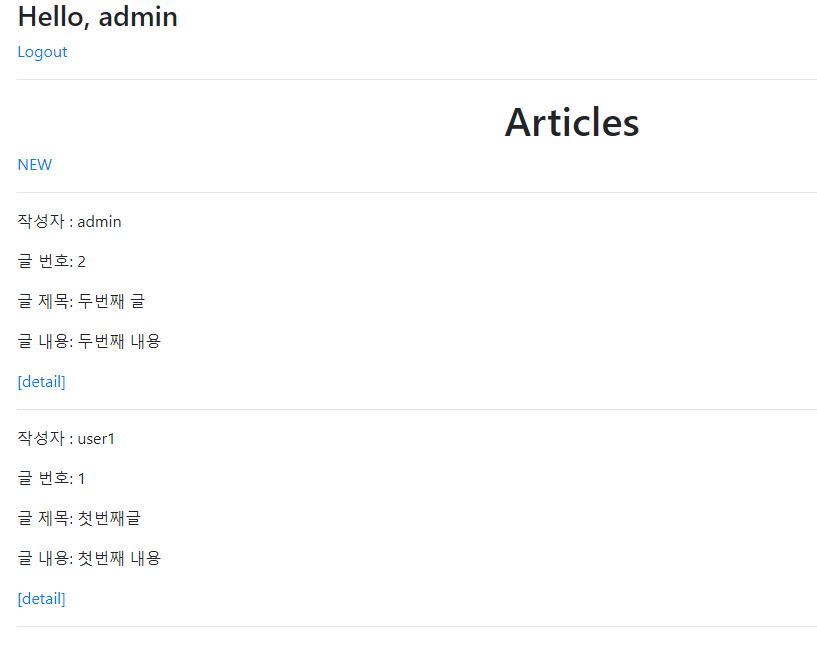
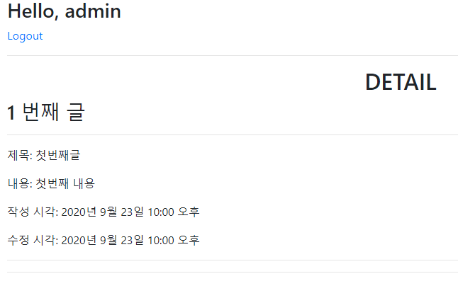
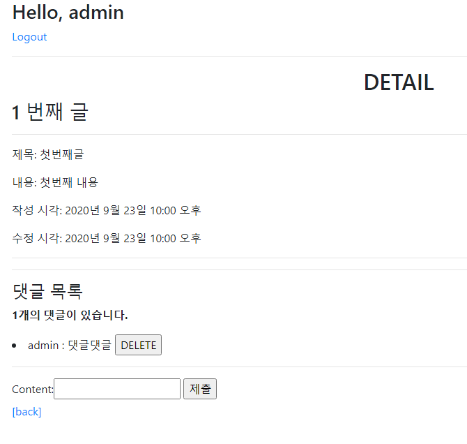
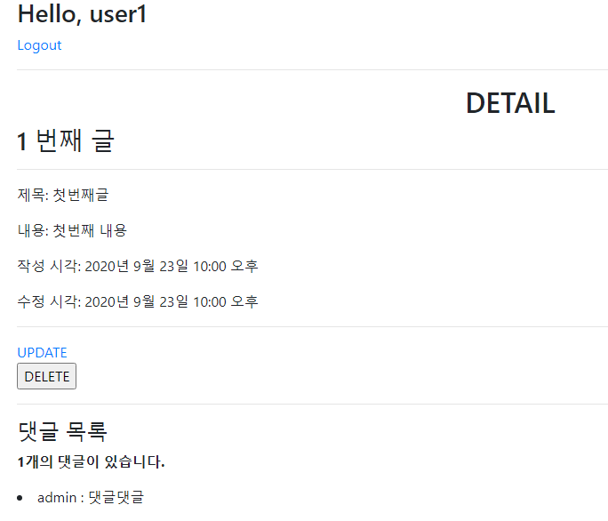

# 0923_workshop

### Django Project

> 대체한 User model을 사용한다.

```python
# accouts/models.py
from django.db import models
from django.contrib.auth.models import AbstractUser

class User(AbstractUser):
    pass
```

```python
# accounts/forms.py
from django.contrib.auth.forms import UserChangeForm, UserCreationForm

class CustomUserCreationForm(UserCreationForm):

    class Meta(UserCreationForm.Meta):
        model = get_user_model()
        fields = UserCreationForm.Meta.fields + ('email',)
```


---

>회원가입이 정상적으로 동작한다.

```python
# accounts/views.py

def signup(request):
    if request.user.is_authenticated:
        return redirect('articles:index')

    if request.method == 'POST':
        form = CustomUserCreationForm(request.POST)
        if form.is_valid():
            user = form.save()
            auth_login(request, user)
            return redirect('articles:index')
    else:
        form = CustomUserCreationForm()
    context = {
        'form': form,
    }
    return render(request, 'accounts/signup.html', context)
```



---

> 메인 페이지에서 각 게시글의 작성자 정보가 출력된다.

```python
# articles/models.py

from django.db import models
from django.conf import settings

# Create your models here.
class Article(models.Model):
    # 추가
    user = models.ForeignKey(settings.AUTH_USER_MODEL, on_delete=models.CASCADE)
    # 생략


class Comment(models.Model):
    # 추가
    user = models.ForeignKey(settings.AUTH_USER_MODEL, on_delete=models.CASCADE)
    # 생략
```

```html
# articles/index.html

<!--추가-->
<p>작성자 : {{ article.user }}</p>
```



---

> 게시글 작성자 본인만 게시글을 수정 및 삭제할 수 있다.

```html
# articles/detail.html

    <a href="">UPDATE</a><br>
    <form action="" method="POST">
      
      <input type="submit" value="DELETE">
    </form>
  
```



---

> 각 댓글에는 댓글 작성자 정보가 출력된다.

```python
# articles/views.py

def create(request):
    # 수정
    article = form.save(commit=False)
    article.user = request.user
    article.save()
    
    
def comments_create(request, pk):
    # 수정
        comment = comment_form.save(commit=False)
        comment.article = article
        comment.user = request.user
        comment.save()    
```

```html
# articles/detail.html
{{ comment.user }} : {{ comment.content }}
```



---

> 댓글 작성자 본인만 댓글을 삭제할 수 있다.

```html

	<input type="submit" value="DELETE">

```

