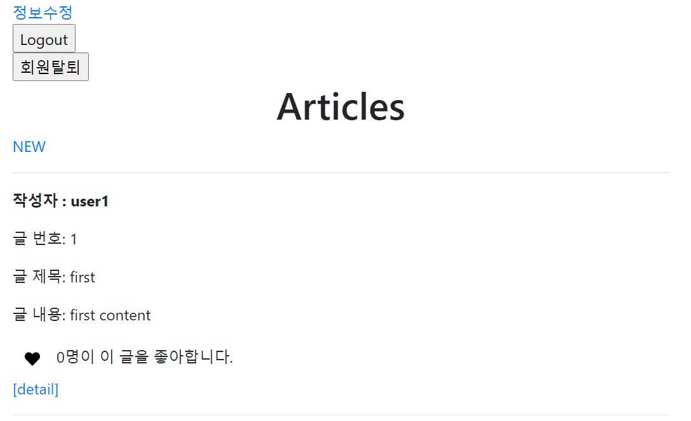

# 0928_workshop

### 1. Model

> 좋아요 기능 구현을 위한 컬럼을 추가한다.

```python
# accouts/models.py
class Article(models.Model):
    user = models.ForeignKey(settings.AUTH_USER_MODEL, on_delete=models.CASCADE)
    # 추가
    like_users = models.ManyToManyField(settings.AUTH_USER_MODEL, related_name='like_articles' )
    title = models.CharField(max_length=10)
    content = models.TextField()
    created_at = models.DateTimeField(auto_now_add=True)
    updated_at = models.DateTimeField(auto_now=True)
    
    def __str__(self):
        return self.title
```

---

### 2. url & view

>/articles/<article_pk>/like/  : 좋아요 작성을 위한 기능을 구현한다.
>
>- 로그인한 유저의 요청만 처리한다. 

```python
# accounts/views.py

@require_POST
def like(request, article_pk):
    if request.user.is_authenticated:
        article = get_object_or_404(Article, pk=article_pk)
        # user가 article을 좋아요 누른 전체유저에 존재하는 지.
        if article.like_users.filter(pk=request.user.pk).exists():
            # 좋아요 취소
            article.like_users.remove(request.user)
        else:
            # 좋아요
            article.like_users.add(request.user)
        return redirect('articles:index')
    return redirect('accounts:login') 
```

---

### 3. Template

> font-awesome에서 좋아요 로직 구현에 활용할 로고를 선택한다.
>
> - 개인 키트를 발급 받은 후 base.html에 붙여 넣는다.
> - 좋아요에 활용되는 로고를 선택한다.
> - 좋아요를 누른 경우 빨간색 하트, 그렇지 않은 경우 검은색 하트가 나오게한다.
> - 특정 글의 좋아요를 누른 전체 인원수를 출력한다.

```html
# articles/index.html
<!--생략-->
<form action="" method="POST" class="d-inline">
    
    
        <button class="btn btn-link" style="color:crimson;">
            <i class="fas fa-heart"></i>
        </button>
    
        <button class="btn btn-link" style="color:black;">
            <i class="fas fa-heart"></i>
        </button>
    
</form>
{{ article.like_users.all|length }}명이 이 글을 좋아합니다.
```



