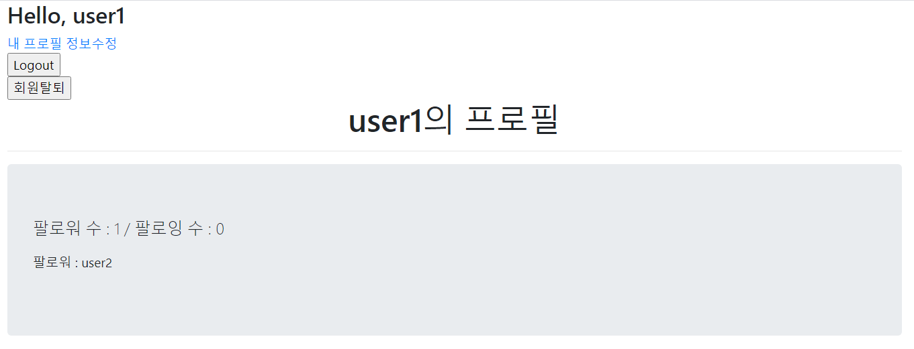
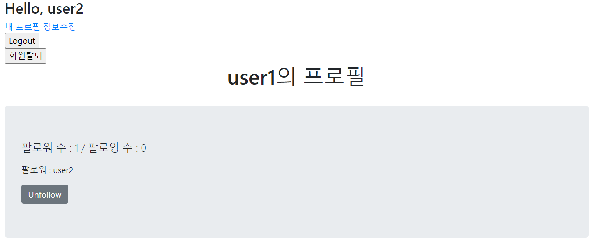
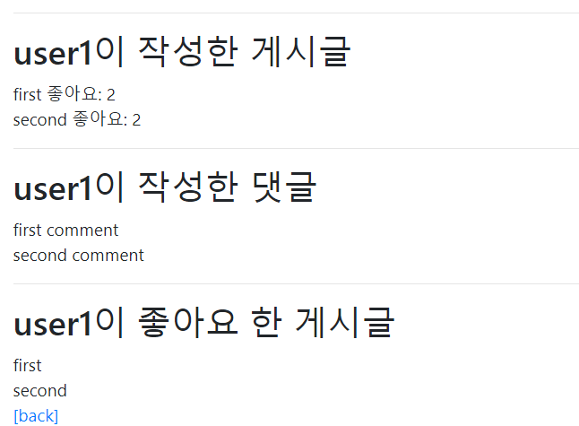

# 0929_practice

### 1. Model & Form

> 팔로우 기능 구현을 위한 모델을 세팅한다. 팔로우 기능을 구현하기 위해 모델을 대체한다.

```python
# accounts/models.py
from django.db import models
from django.contrib.auth.models import AbstractUser

class User(AbstractUser):
    followgins = models.ManyToManyField('self', symmetrical=False, related_name='followers')
```

---

### 2. url & view

>/accounts/<username>/ :  유저 프로필 페이지 기능을 구현한다.
>
>/accounts/<username>/ follow/ : 팔로우를 하기 위한 기능을 구현한다.
>
>- 로그인한 유저만 팔로우를 할 수 있다. 
>- 본인은 팔로우를 할 수 없다.

```python
# accounts/urls.py
from django.urls import path
from . import views

app_name = 'accounts'
urlpatterns = [
    # 생략
    path('<username>/', views.profile, name='profile'),
    path('<username>/follow/', views.follow, name='follow'),
]
```

```python
# accounts/views.py

def profile(request, username):
    person = get_object_or_404(get_user_model(), username=username)
    context = {
        'person':person,
    } 
    return render(request, 'accounts/profile.html', context)


@require_POST
@login_required
def follow(request, user_pk):
    you = get_object_or_404(get_user_model(), pk=user_pk)
    me = request.user

    if me != you:
        if you.followers.filter(pk=me.pk).exists():
            you.followers.remove(me)
        else:
            you.followers.add(me)
    return redirect('accounts:profile', you.username)
```

---

### 3. Template

> index.html의 username에 profile로 갈 수 있는 링크를 설정한다. 팔로잉 여부에 따라 팔로우와 언팔로우 버튼은 토글될 수 있도록 구성한다.
>
> - 로그인한 유저 자신의 프로필 페이지에서는 팔로우 & 언팔로우 버튼이 보이지 않는다.
> - 작성자의 팔로잉, 팔로워 숫자를 보여주고 유저의 이름을 모두 출력한다.
> - 해당 프로필의 유저가 작성한 모든 글의 내용과 좋아요 숫자를 보여준다.

```html
# articles/_follow.html
<!--팔로워 수 / 팔로잉 수-->
<div class="jumbotron">
    
        <p class="lead">
        팔로워 수 : {{ followers|length }} / 팔로잉 수 : {{followings|length}}
        </p>
        <p>팔로워 : 
        
        {{ follower.username }}
        </p>
        <!--팔로우 버튼 / 언팔로우 버튼 -->
        
        <form action="" method="POST">
            
            
                <button class="btn btn-secondary">Unfollow</button>
            
                <button class="btn btn-primary">Follow</button>
            
        </form>
        
    
</div>
```

```html
# articles/index.html
<!--생략-->
<form action="" method="POST" class="d-inline">
    
    
        <button class="btn btn-link" style="color:crimson;">
            <i class="fas fa-heart"></i>
        </button>
    
        <button class="btn btn-link" style="color:black;">
            <i class="fas fa-heart"></i>
        </button>
    
</form>
{{ article.like_users.all|length }}명이 이 글을 좋아합니다.
```





