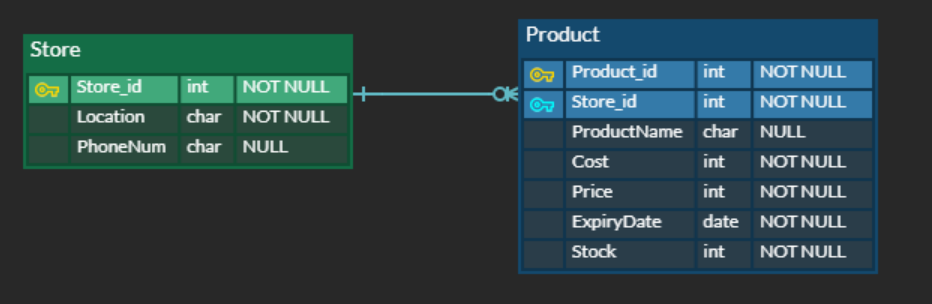

# 0929_workshop

### 1. ERD



👉 한 상점에는 상품이 없거나 여러개가 있을 수 있다.

👉 각 상품에 key값을 주어 중복을 막고, 재고를 확인할 수 있도록 `Stock`필드를 추가했다.

👉 재고관리에 필수적인 필드들은 `NOT NULL` 조건을 넣어줬다.

👉 유통기한이 임박한 상품들을 처리하기 편리하도록 `ExpiryDate`필드를 추가했다.

```python
from django.db import models
from django.conf import settings

class Store(models.Model):
    location = models.CharField(max_length=20)
    phonenum = models.CharField(max_length=20, null=True)


class Product(models.Model):
    store = models.ForeignKey(Store, on_delete=CASCADE)
    productname = models.CharField(max_length=30, null=True)
    cost = models.IntegerField()
    price = models.IntegerField()
    expirydate = models.DateField()
    stock = models.IntegerField()
```


