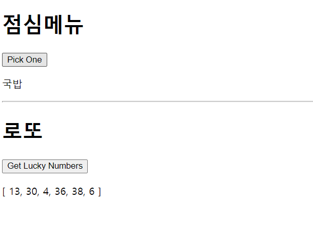

# 1109_workshop

```html
<!DOCTYPE html>
<html lang="en">
<head>
    <meta charset="UTF-8">
    <meta name="viewport" content="width=device-width, initial-scale=1.0">
    <title>Document</title>
</head>
<body>
    <div id="app">
        <h1>점심메뉴</h1>
        <button @click="pickOneInLunch">Pick One</button>
        <p>{{ selectedLunchMenu }}</p>
        <hr>

        <h1>로또</h1>
        <button @click="pickLotto">Get Lucky Numbers</button>
        <p>{{ selectedLotto }}</p>
    </div>

    <script src="https://cdn.jsdelivr.net/npm/vue/dist/vue.js"></script>
    <script src="https://cdn.jsdelivr.net/npm/lodash@4.17.20/lodash.min.js"></script>
    <script>
        const app = new Vue ({
            el: "#app",
            data: {
                lunch: ['짬뽕', '짜장면', '탕수육', '국밥'],
                selectedLunchMenu: '', 
                numbers: _.range(1,46),
                Lotto: '',
            },
            methods: {
                pickOneInLunch: function () {
                    this.selectedLunchMenu = _.sample(this.lunch)
                },
                pickLotto: function () {
                    const selectedLotto = _.sampleSize(this.numbers, 6)
                    const sortedLotto = _.sortBy(selectedLotto)
                    this.Lotto = sortedLotto
                }
            }
        })
    </script>
</body>
</html>
```




