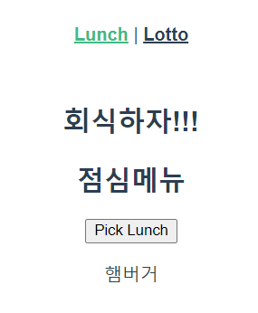

# 1111_practice

- views/Lotto.vue

```vue
<template>
    <div>
        <h2>로또</h2>
        <button @click="pickLotto">Get Lucky Numbers</button>
        <p>{{ Lotto }}</p>
    </div>

</template>

<script>
import _ from 'lodash'

export default {
    name: 'Lotto',
    data: function () {
        return {
            numbers: _.range(1,46),
            Lotto: '',  
        }
    },
    methods: {
        pickLotto: function () {
            const selectedLotto = _.sampleSize(this.numbers, 6)
            const sortedLotto = _.sortBy(selectedLotto)
            this.Lotto = sortedLotto
        } 
    }
}
</script>

<style>

</style>
```

---

- views/Lunch.vue

```vue
<template>
    <div>
    <!-- 3. 컴포넌트 보여주기 -->
    <Captain/>
    <h2>점심메뉴</h2>
    <button @click="pickOneInLunchMenu">Pick Lunch</button>
    <p> {{ selectedLunchMenu }} </p>
  </div>
</template>

<script>
import _ from 'lodash'
// 1. 컴포넌트 불러오기
import Captain from '@/components/Captain.vue'

export default {
    name: 'Lunch',
    // 2. 컴포넌트 사용 등록하기
    components: {
        Captain
    },
    data: function () {
        return {
            lunch: ['짬뽕', '짜장면', '탕수육', '햄버거'],
            selectedLunchMenu: '',
        }
    },
    methods : {
        pickOneInLunchMenu: function () {
         const randomIndex = _.random(this.lunch.length-1)
         this.selectedLunchMenu = this.lunch[randomIndex]
        }
    },
}
</script>

<style>

</style>
```

---

- App.vue

```vue
<template>
  <div id="app">
    <div id="nav">
      <router-link to="/lunch">Lunch</router-link> |
      <router-link to="/lotto">Lotto</router-link>
    </div>
    <!-- 라우터 정보에 맞는 컴포넌트들이 <router-view/>자리에 넣어진다. -->
    <router-view/>
  </div>
</template>

<style>
#app {
  font-family: Avenir, Helvetica, Arial, sans-serif;
  -webkit-font-smoothing: antialiased;
  -moz-osx-font-smoothing: grayscale;
  text-align: center;
  color: #2c3e50;
}

#nav {
  padding: 30px;
}

#nav a {
  font-weight: bold;
  color: #2c3e50;
}

#nav a.router-link-exact-active {
  color: #42b983;
}
</style>
```

---

- index.js

```javascript
import Vue from 'vue'
import VueRouter from 'vue-router'
import Lunch from '../views/Lunch.vue'
import Lotto from '../views/Lotto.vue'

Vue.use(VueRouter)

const routes = [
  {
    path: '/lunch',
    name: 'Lunch',
    component: Lunch
  },
  {
    path: '/lotto',
    name: 'Lotto',
    component: Lotto
  },
]

const router = new VueRouter({
  mode: 'history',
  base: process.env.BASE_URL,
  routes
})

export default router
```

---



