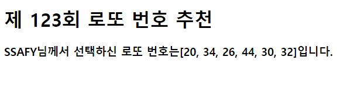

# 0814_workshop

1) intro/urls.py

```python
from django.contrib import admin
from django.urls import path
from pages import views

urlpatterns = [
    path('admin/', admin.site.urls),
    path('lotto/', views.lotto),
]
```


2) pages/views.py

```python
import random
from django.shortcuts import render

# Create your views here
def lotto(request):
    numbers = random.sample(range(1,46),6)
    context = {
        'numbers' : numbers
    }
    return render(request, 'lotto.html', context)
```


3) templates/lotto.html

```html
<!DOCTYPE html>
<html lang="en">
<head>
    <meta charset="UTF-8">
    <meta name="viewport" content="width=device-width, initial-scale=1.0">
    <title>Document</title>
</head>
<body>
    <h1>제 123회 로또 번호 추천</h1>
    <h3>SSAFY님께서 선택하신 로또 번호는{{numbers}}입니다.</h3>
</body>
</html>
```

---

### [실행화면]

