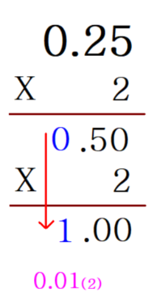

# SW응용 (Problems)

#### 문제 01) 5185. [파이썬 S/W 문제해결 구현] 1일차 - 이진수

#### 풀이 01) 

✔ 입력받은 16진수를 10진수로 변환한다. `int(x, 16)`

✔ 10진수를 4자리의 2진수로 변환한다. `format(x, '04b')`

```python
T = int(input())
for tc in range(1, 1+T):
    N, numbers = input().split()
    N = int(N)
    print(f'#{tc} ', end='')
    for n in range(N):
        t = format(int(numbers[n], 16), '04b')
        print(t, end='')
    print()
```

---

#### 문제 02) 5186. [파이썬 S/W 문제해결 구현] 1일차 - 이진수2

#### 풀이 02) 

✔ 실수에 2를 곱하여 정수부분을 차례로 출력한다.



```python
T = int(input())
for tc in range(1, 1+T):
    N = float(input())
    res = ''
    l = 0
    while N:
        N *= 2
        l += 1
        temp = str(N)
        res += temp[0]
        if temp[0] == '1':
            N -= 1
        if l == 13:
            res = 'overflow'
            break
    print(f'#{tc} {res}')
```

---

#### 문제 03) [4366. 정식이의 은행업무](https://swexpertacademy.com/main/code/problem/problemDetail.do?contestProbId=AWMeRLz6kC0DFAXd)

#### 풀이 03)

✔ 입력받은 2진수와 3진수를 한자리씩 수정하며 같은 10진수인지 확인한다.

```python
# n진수 한자리씩 수정하는 함수
def correct(i, n, mistake):
    temp = mistake[:]
    temp[i//n] = str(i % n)
    ans = ''.join(temp)
    return ans


def compare():
    for b in range(len(binary)*2):
        new_binary = correct(b, 2, binary)
        for t in range(len(ternary)*3):
            new_ternary = correct(t, 3, ternary)
            if int(new_binary, 2) == int(new_ternary, 3):
                print(f'#{tc} {int(new_binary, 2)}')
                return

#--------------------------------------------------
T = int(input())
for tc in range(1, 1+T):
    binary = list(input())
    ternary = list(input())
    compare()
```

---

#### 문제 04) 1240. [S/W 문제해결 응용] 1일차 - 단순 2진 암호코드

#### 풀이 04)

✔ 모든 password는 1로 끝나기 때문에, 암호를 뒤에서부터 판독하여 1이 나오면 정해진 길이만큼 추출한다.

✔ 추출한 암호가 유효한지 확인한다.

```python
def find_code(N, M):
    for i in range(N):
        for j in range(M-1, -1, -1):
            if arr[i][j] == '1':
                return arr[i][j-55:j+1]


def solve_code(code):
    answer = ''
    for i in range(8):
        mini_code = code[i*7:i*7+7]
        mini_code_solve = ''
        cnt = 1
        for j in range(6):
            if mini_code[j] == mini_code[j+1]:
                cnt += 1
            else:
                mini_code_solve += str(cnt)
                cnt = 1
        else:
            mini_code_solve += str(cnt)
            for p in range(10):
                if password[p] == mini_code_solve:
                    answer += str(p)
    return answer


def verify(answer):
    ans = 0
    for i in range(7):
        if (i+1) % 2:
            ans += int(answer[i])*3
        else:
            ans += int(answer[i])
    ans += int(answer[7])
    if ans % 10:
        return 0
    else:
        ans = 0
        for i in range(8):
            ans += int(answer[i])
        return ans

#---------------------------------------------------------------------------------------
password = ['3211', '2221', '2122', '1411', '1132', '1231', '1114', '1312', '1213', '3112']
T = int(input())
for tc in range(1, 1+T):
    N, M = map(int, input().split())
    arr = [input() for _ in range(N)]
    # 암호코드 추출하기
    code = find_code(N, M)
    # 암호 풀기
    answer = solve_code(code)
    # 암호 검증하기
    ans = verify(answer)
    print(f'#{tc} {ans}')
```

---

#### 문제 05) [1242. [S/W 문제해결 응용] 1일차 - 암호코드 스캔](https://swexpertacademy.com/main/code/problem/problemDetail.do?contestProbId=AV15JEKKAM8CFAYD)

#### 풀이 05)

```python

```

---

#### 문제 06) 5201. [파이썬 S/W 문제해결 구현] 3일차 - 컨테이너 운반

#### 풀이 06)

✔ 컨테이너의 무게와 화물차의 용량을 내림차순으로 정렬한다.

✔ 무게 < 용량일 때 : 남은 차 중 가장 큰 화물차에  컨테이너 1개를 넣는다.

✔ 무게 > 용량일 때 : 남은 차 중 가장 큰 화물차에  운반가능한 컨테이너 중 가장 무거운 컨테이너 1개를 넣는다.

```python
T = int(input())
for tc in range(1, 1+T):
    N, M = map(int, input().split())
    weight = list(map(int, input().split()))
    volume = list(map(int, input().split()))
    weight.sort(reverse=True)
    volume.sort(reverse=True)
    w = v = res = 0
    while w < N and v < M:
        if volume[v] >= weight[w]:
            res += weight[w]
            v += 1
            w += 1
        else:
            w += 1
    print(f'#{tc} {res}')
```

---

#### 문제 07) 5202. [파이썬 S/W 문제해결 구현] 3일차 - 화물 도크

#### 풀이 07)

✔ 종료시간 기준으로 정렬하고, 첫번째 작업은 무조건 선택한다.

✔ 현재 선택된 작업의 종료시간 이후에 시작하는 작업을 선택한다.

```python
T = int(input())
for tc in range(1, 1+T):
    N = int(input())
    time_table = [list(map(int, input().split())) for _ in range(N)]
    time_table.sort(key=lambda x: x[1])
    i = res = tmp = 0
    while i < N:
        if time_table[i][0] >= tmp:
            res += 1
            tmp = time_table[i][1]
        i += 1
    print(f'#{tc} {res}')
```

---

#### 문제 08) 5203. [파이썬 S/W 문제해결 구현] 3일차 - 베이비진 게임

#### 풀이 08)

✔ 카드를 한 장 씩 나누어 가질 때 마다 babygin 여부를 확인한다.

```python
def babygin():
    i = 0
    while i < 10:
        if (player1[i] >= 3) or (player1[i] >= 1 and player1[i+1] >= 1 and player1[i+2] >= 1):
            return 1
        if (player2[i] >= 3) or player2[i] >= 1 and player2[i+1] >= 1 and player2[i+2] >= 1:
            return 2
        i += 1
    return 0

#------------------------------------------------
T = int(input())
for tc in range(1, 1+T):
    player1 = [0]*12
    player2 = [0]*12
    arr = list(map(int, input().split()))
    i = v = 0
    #  player1, player2에게 카드를 한 장 씩 나누어주며 babygin 여부를 확인한다.
    while i < 12:
        if i % 2:
            player2[arr[i]] += 1
        else:
            player1[arr[i]] += 1

        if i >= 4:
            res = babygin()
            # player1, player2중에 누군가 이겼을 때
            if res:
                print(f'#{tc} {res}')
                v = 1
        if v == 1:
            break
        i += 1
    # 끝까지 무승부이면 0 출력
    if v == 0:
        print(f'#{tc} 0')
```

---

#### 문제 09) 5188. [파이썬 S/W 문제해결 구현] 2일차 - 최소합

#### 풀이 09)

✔ 이동방향은 우,하 2가지 뿐이므로, 각 칸의 최소합을 구하면 된다.

✔ 가장자리(세로) : +윗칸 

✔ 가장자리(가로) : +왼쪽칸

✔ 나머지: +(윗칸과 왼쪽칸 중 더 작은 값)

```python
T = int(input())
for tc in range(1, 1+T):
    N = int(input())
    arr = [list(map(int, input().split())) for _ in range(N)]
    distance = [[0]*N for _ in range(N)]
    distance[0][0] = arr[0][0]
    for x in range(N):
        for y in range(N):
            if x == 0:
                distance[x][y] = distance[x][y-1] + arr[x][y]
            elif y == 0:
                distance[x][y] = distance[x-1][y] + arr[x][y]
            else:
                distance[x][y] = min(distance[x][y-1], distance[x-1][y]) + arr[x][y]
    print(f'#{tc} {distance[N-1][N-1]}')
```

---

#### 문제 10) 5189. [파이썬 S/W 문제해결 구현] 2일차 - 전자카트

#### 풀이 10)

✔

✔

```python
def p(depth, n):
    if depth == n:
        route.append(arr[:])
        return
    for idx in range(depth, n):
        arr[idx], arr[depth] = arr[depth], arr[idx]
        p(depth+1, n)
        arr[idx], arr[depth] = arr[depth], arr[idx]

#----------------------------------------------------------------
T = int(input())
for tc in range(1, 1+T):
    N = int(input())
    battery = [list(map(int, input().split())) for _ in range(N)]
    arr = [n+2 for n in range(N-1)]
    route = []
    # 경로 경우의수 (순열)
    p(0, N-1)
    # 각 경로의 배터리 소비량 찾기
    min = 987654321
    res = 0
    while route:
        r = route.pop()
        res += battery[0][r[0]-1]
        for i in range(len(r)-1):
            res += battery[r[i]-1][r[i+1]-1]
        res += battery[r[-1]-1][0]
        if res < min:
            min = res
        res = 0
    print(f'#{tc} {min}')
```

---

#### 문제 11) [1244. [S/W 문제해결 응용] 2일차 - 최대 상금](https://swexpertacademy.com/main/code/problem/problemDetail.do?contestProbId=AV15Khn6AN0CFAYD#)

#### 풀이 11)

✔

✔

```python

```

---

#### 문제 12) [1865. 동철이의 일 분배](https://swexpertacademy.com/main/code/problem/problemDetail.do?contestProbId=AV5LuHfqDz8DFAXc)

#### 풀이 12)

✔

✔


```python
def p(n, k, x):
    global max
    if x <= max:
        return
    elif n == k and x > max:
        max = x
    else:
        for idx in range(n, k):
            arr[idx], arr[n] = arr[n], arr[idx]
            p(n+1, k, x*prob[n][arr[n]]/100)
            arr[idx], arr[n] = arr[n], arr[idx]

#--------------------------------------------------
T = int(input())
for tc in range(1, 1+T):
    N = int(input())
    prob = [list(map(int, input().split())) for _ in range(N)]
    arr = [i for i in range(N)]
    max = 0
    p(0, N, 1)
    print('#%d %.6f' % (tc, max*100))
```

---

#### 문제 13) [4008. [모의 SW 역량테스트] 숫자 만들기](https://swexpertacademy.com/main/code/problem/problemDetail.do?contestProbId=AWIeRZV6kBUDFAVH#)

#### 풀이 13)

✔

✔

```python

```

